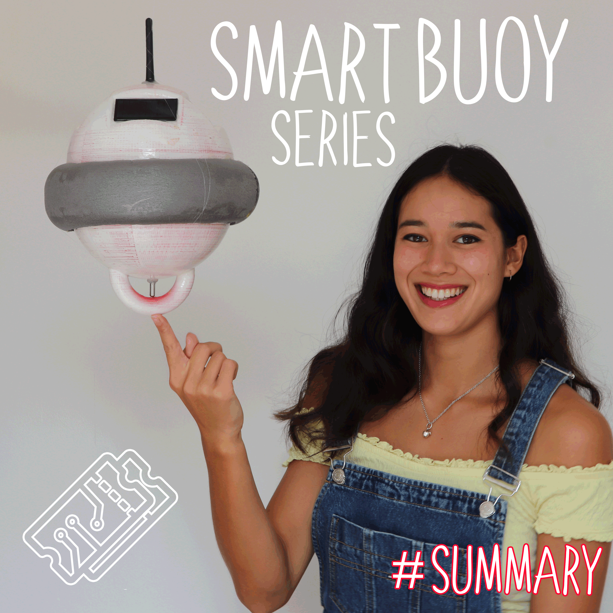
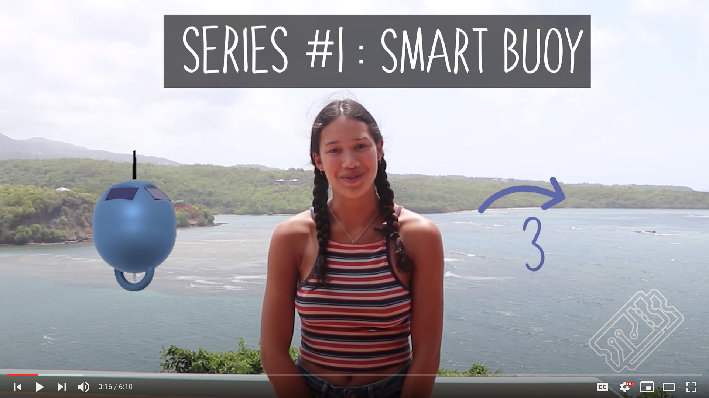
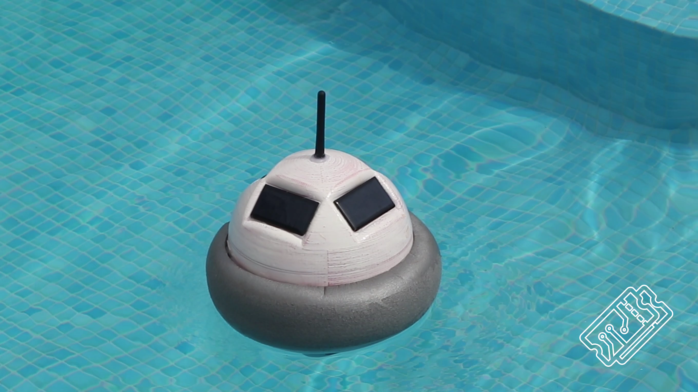
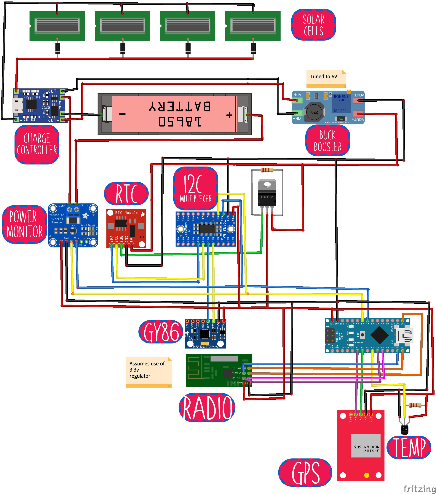
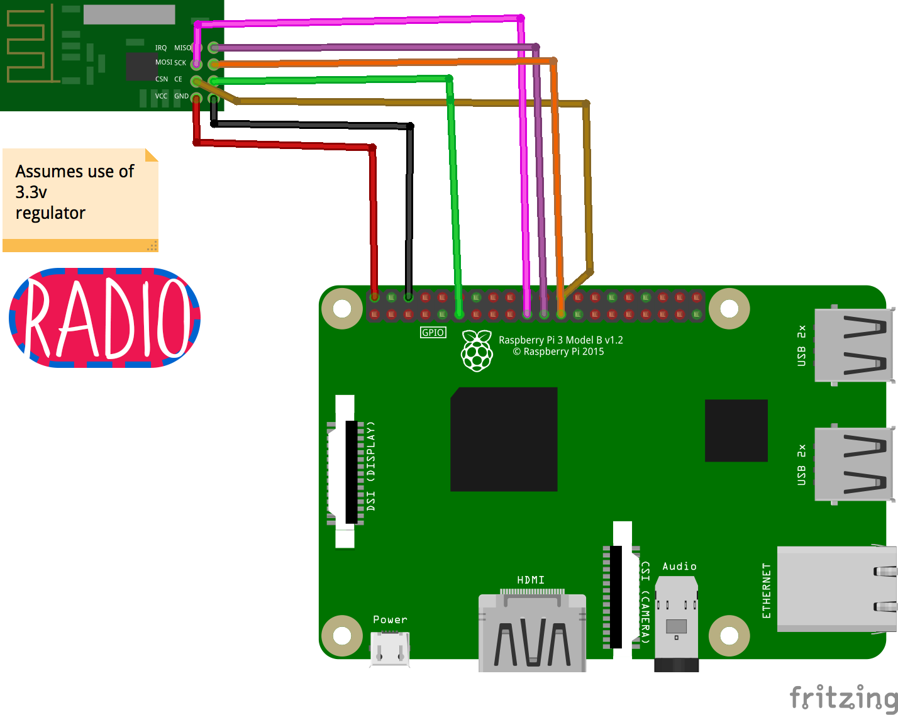
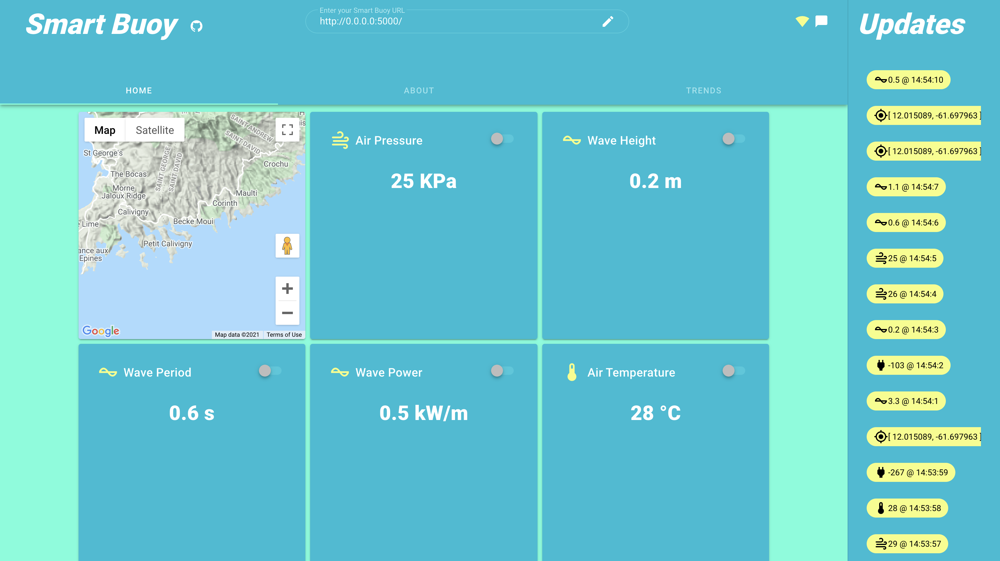
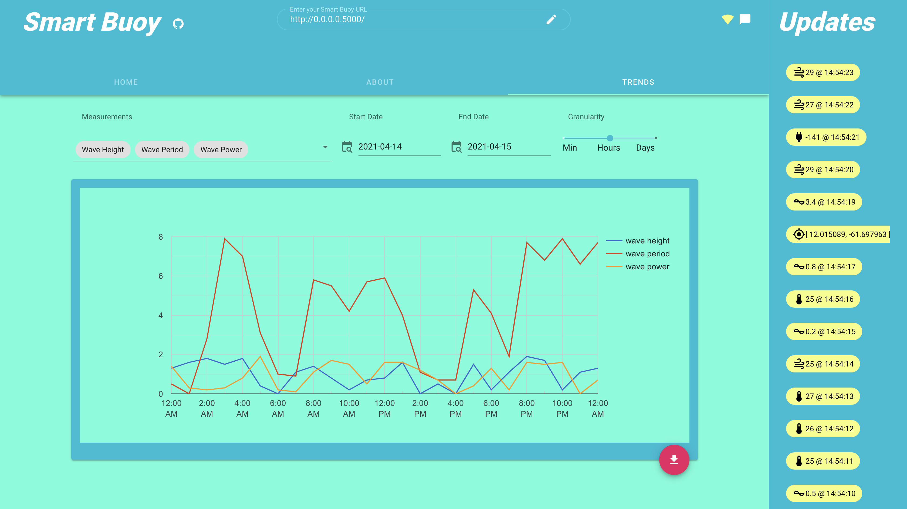

# [T3chFlicks](https://t3chflicks.org): Smart Buoy

> A complete ocean characteristic measuring and analytics system.

🎖️ Featured by [Raspberry Pi Blogs](https://www.raspberrypi.org/blog/good-buoy-the-raspberry-pi-smart-buoy/)

🎖️ Featured by [Hackaday](https://hackaday.com/2019/09/11/smart-buoy-rides-the-citizen-science-wave/)

🎖️ Featured by [Adafruit Blogs](https://blog.adafruit.com/2019/07/19/this-smart-buoy-measures-wave-height-period-power-and-more-piday-raspberrypi-raspberry_pi/)

🎖️ Featured by [Arduino](https://www.facebook.com/official.arduino/posts/3480468415312786)

🎖️ Featured by [Instructables](https://www.instructables.com/Smart-Buoy/)

🎖️ Second place [Instructables Sensor Contest](https://www.instructables.com/contest/sensors2019/)

---

## `tutorials/`
### Summary

 

### 1. Wave and Temperature Measurements

### 2. GPS, Radio, and SD card

### 3. Scheduling Power

### 4. Waterproofing, Dashboards and Deploy

---

## `src/` - contains the source code for the whole project
* `buoy/` contains the code which runs on an Arduino inside the Buoy, as well as the build files (3d model, schematic etc).

* `baseStation/` contains the code for the server, database, and dashboard.
for the dashboard which is a VueJS application

---

## 💡 Product Showcase
> 
> 
> 
> 
> 
* Environment
  * Wave measurements
    * Size
    * Period
    * Power
    * Direction
    * Water temperature
  * Air
    * Temperature
    * Humidity
    * Pressure
  * Position (GPS)
* Power
  * Solar powered
  * Scheduled time for power based on battery voltage
* Radio Communication (Range 1KM)
* Interactive dashboard 
  * Realtime view
  * Graph historical measurements

---

This project was created by [T3chFlicks](https://t3chflicks.org) - A tech focused education and services company.

---