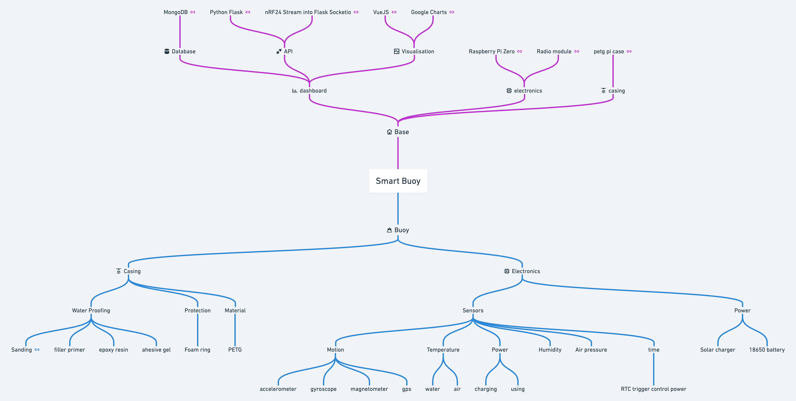

# Introduction

We all love the seaside. As a collective, we flock to it for holidays, to enjoy water sports or to make our livelihood. But the coast is a dynamic area at the mercy of waves. Rising sea levels nibble at beaches and powerful extreme events like hurricanes completely decimate them. To understand how to save them, we need to understand the forces driving their change.

Research is expensive, but if you could create cheap, effective instruments, you would be able to generate more data – ultimately improving understanding. This was the thinking behind our Smart Buoy project. In this summary, we give you a quick run down of our project and break it down into design, the make and data presentation. Oh buoy, you’re going to love this..!

🎖️ Featured by [Raspberry Pi Blogs](https://www.raspberrypi.org/blog/good-buoy-the-raspberry-pi-smart-buoy/)

🎖️ Featured by [Hackaday](https://hackaday.com/2019/09/11/smart-buoy-rides-the-citizen-science-wave/)

🎖️ Featured by [Adafruit Blogs](https://blog.adafruit.com/2019/07/19/this-smart-buoy-measures-wave-height-period-power-and-more-piday-raspberrypi-raspberry_pi/)

🎖️ Featured by [Arduino](https://www.facebook.com/official.arduino/posts/3480468415312786)

🎖️ Featured by [Instructables](https://www.instructables.com/Smart-Buoy/)

🎖️ Second place [Instructables Sensor Contest](https://www.instructables.com/contest/sensors2019/)

[https://whimsical.com/smart-buoy-2x7PNzVxmZx7oKikP9o2LP](https://whimsical.com/smart-buoy-2x7PNzVxmZx7oKikP9o2LP)

## Dashboard


Get a peak at the dashboard  👈


