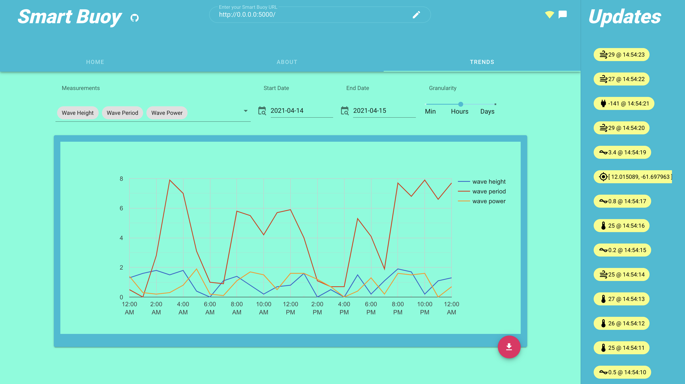

## BaseStation

This folder contains the code for the running the server for the
Smart Buoy Dashboard.

This code should be run on a Raspberry Pi, which has Python3 and mongoDB installed.

It uses Flask as a web server and communicates with the radio module (NRF24) and a mongo database.
Flask-socketio is used for communication with the frontend via websockets.

If you want to play around with the dashboard without a Smart Buoy setup then just run `python mock_app.py`, and you should be able to see the data coming in.

Also for development purposes there is a `populate_db.py` script which does what is says on the tin.

If you just want to see the data coming from the Buoy to the Raspberry Pi via radio then you can use the `listen_to_radio.py` script.

---

### Get Running
1. Put a raspian image from [here](https://www.raspberrypi.org/downloads/) onto your pi sd card using [etcher](https://www.balena.io/etcher/).
1. Plug in the *nRF24L01* before turning on as in the diagram in the electronics folder.
1. SSH into your pi (for the rest of the instructions stay in a terminal) and set up as usual [tutorial](https://www.youtube.com/watch?v=wvxCNQ5AYPg).
1. Install python3 - [tutorial](https://installvirtual.com/install-python-3-7-on-raspberry-pi/).
1. Install mongoDB - [tutorial](https://andyfelong.com/2019/01/mongodb-3-2-64-bit-running-on-raspberry-pi-3-with-caveats/). Create a DB in mongo called 'buoyDB' and a collection called 'buoyMeasurements'.
    1. `sudo apt-get install mongodb`
    1. `sudo service mongodb start`
    1. `mongo`
    1. `use buoyDB`
    1. `db.createCollection('buoyMeasurements')`
1. Install python dependencies `pip install -r requirements.txt`
7. Update the fields in `frontend/.env` to use your google maps api key (https://developers.google.com/maps/documentation/javascript/get-api-key) and your Raspberry Pis IP address.
1. Build the frontend:
    1. `cd frontend`
    1. `npm i`
    1. `npm run build`

1. Start the server `python app.py`
1. Go to your browser on your pi's IP address or to the  and enter your IP address to connect the dashboard to the Pi and measurements should begin to stream in.

